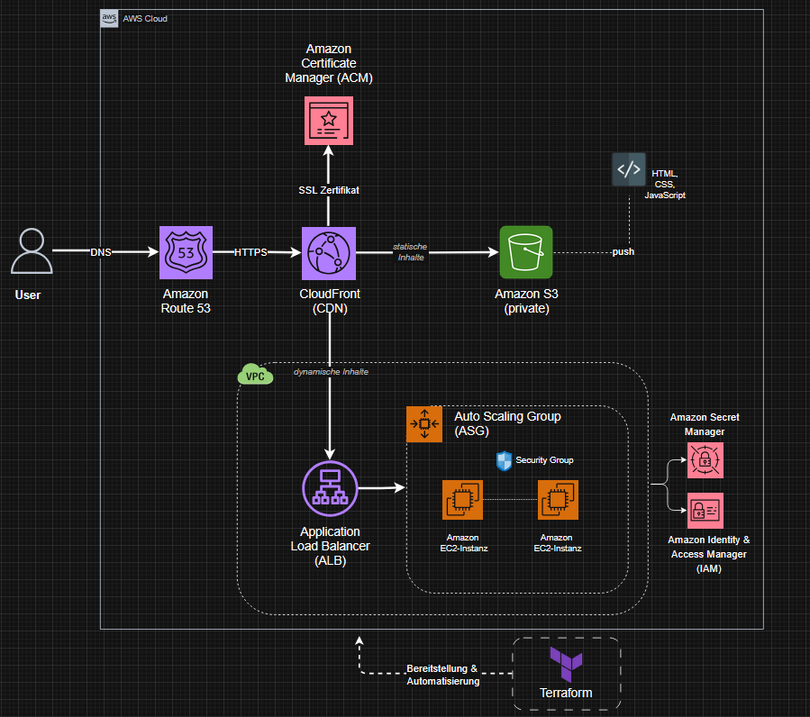

# Amazon Web Services (AWS) Cloud Infrastructure Projekt
Im Rahmen dieses Projekts wird eine Cloud-Infrastruktur auf Amazon Web Services (AWS) aufgebaut und 
mit Terraform automatisiert bereitgestellt.

## Voraussetzungen
- AWS CLI konfigurieren
- Terraform installieren -> https://developer.hashicorp.com/terraform/install
- AWS IAM User mit Admin-Rechten anlegen

## Architektur


Infrastruktur-Bereiche:
- **Statische Inhalte (CDN-Pfad):**
User → Route 53 → CloudFront → S3 (privat)
- **Dynamische Inhalte (ALB-Pfad):**
CloudFront → Application Load Balancer (ALB) → EC2-Instanzen (via Auto Scaling Group [ASG])

## Technologien
- Terraform (Infrastructure as Code)
- Amazon S3 (Speicherung statischer Website-Dateien)
- Amazon CloudFront (CDN für globale Auslieferung)
- Amazon VPC (Privates Netzwerk)
- Application Load Balancer (Lastverteilung auf EC2-Instanzen)
- Auto Scaling Group (Automatische Skalierung der EC2-Instanzen)
- IAM (Zugriffsverwaltung und Rollen)
- AWS Secrets Manager (Sichere Verwaltung von Zugangsdaten)
- ACM + Route 53 (SSL-Zertifikat + DNS)

### S3 + CloudFront
- Privater S3-Bucket mit serverseitiger Verschlüsselung (AES256)
- CloudFront Distribution mit Origin Access Control (OAC)
- HTTPS erzwungen, nur GET/HEAD erlaubt
- Bucket Policy erlaubt Zugriff ausschließlich über CloudFront

### VPC + Netzwerk
- VPC mit CIDR `10.0.0.0/16`
- 2 öffentliche Subnetze in verschiedenen Availability Zones
  - `public-subnet-a` (eu-central-1a) — `10.0.1.0/24`
  - `public-subnet-b` (eu-central-1b) — `10.0.2.0/24`
- Internet Gateway + öffentliche Routing-Tabelle

### Security Groups
- **ALB Security Group:** HTTP (80) + HTTPS (443) offen
- **EC2 Security Group:** Port 80: Traffic nur vom ALB erlaubt

### Application Load Balancer
- ALB in zwei Availability Zones
- Target Group mit HTTP Health Checks
- Listener auf Port 80

### EC2 + Auto Scaling Group
- Launch Template (t3.micro = free tier)
- Apache HTTP Server (httpd) automatisch installiert via User Data
- ASG: gewünschte Kapazität 2, min. 1, max. 3 Instanzen

### IAM + Secrets Manager
- IAM-Rolle `ec2-project-role` für EC2-Instanzen
- Beispiel-Secret in AWS Secrets Manager angelegt

### ACM + Route 53
ACM-Zertifikate erfordern eine eigene Domain zur DNS-Validierung.
Da dieses Projekt keine eigene Domain verwendet, wird ACM/Route 53 konzeptionell dokumentiert:

Umsetzung:
1. Domain in Route 53 registrieren
2. ACM-Zertifikat für die Domain beantragen
3. DNS-Validierung über Route 53 durchführen
4. ALB mit HTTPS (Port 443) und ACM-Zertifikat absichern
5. CloudFront mit eigenem SSL-Zertifikat absichern

## Sicherheitshinweise
- Privater S3-Bucket (kein direkter öffentlicher Zugriff)
- EC2-Instanzen sind nur über den ALB erreichbar
- Alle Daten im S3-Bucket sind serverseitig verschlüsselt (AES256)
- IAM Least Privilege Prinzip angewendet

## Deployment mittels Terraform
**Infrastruktur aufbauen:**
```
terraform init
terraform plan
terraform apply
```

**Infrastruktur löschen:**
```
terraform destroy
```

## Projektstruktur
```
aws-cloud-infrastructure/
├── main.tf
├── variables.tf
├── provider.tf
└── website/
    └── index.html
```
